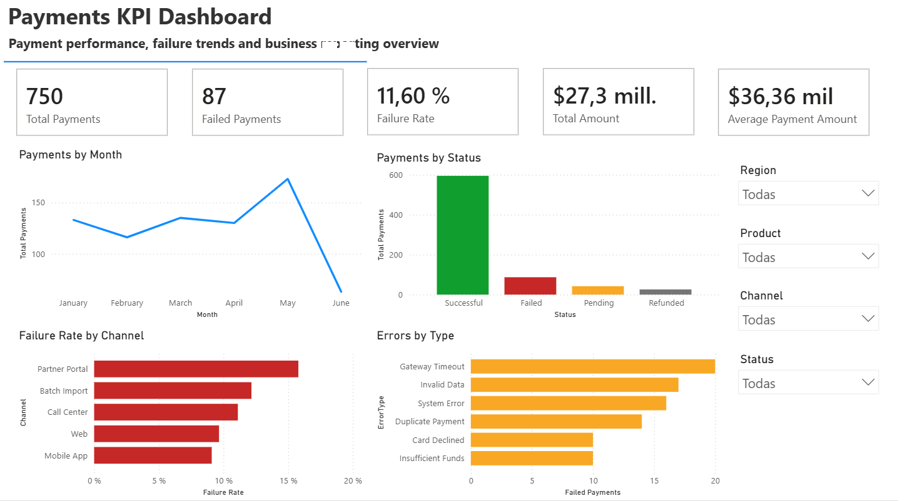
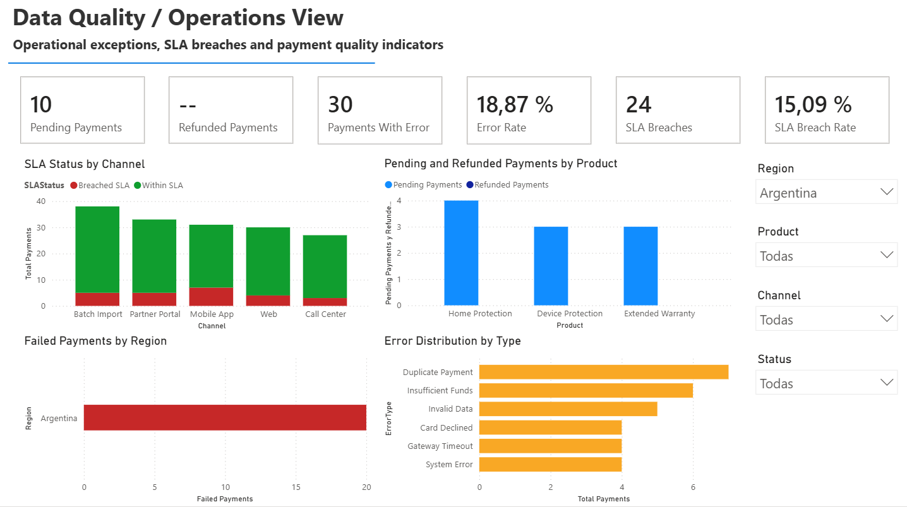
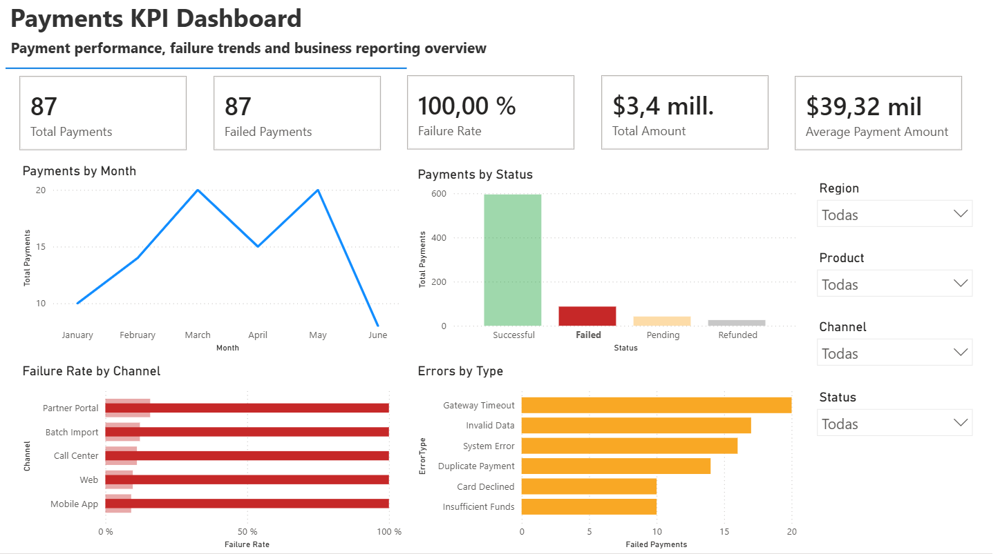
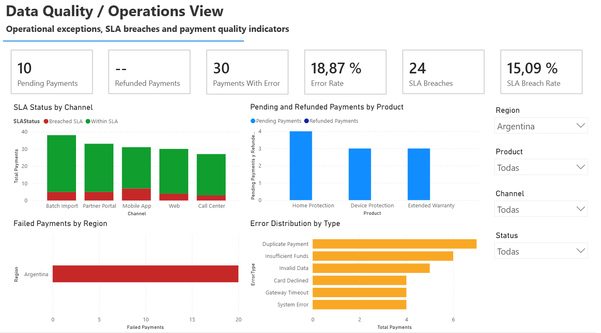

# Power BI Payments KPI Dashboard

This repository contains a Power BI reporting project focused on payment performance, failed transactions, error trends, SLA monitoring, DAX measures, SQL validation logic, and business-friendly dashboard design.

The project uses a fully synthetic payments dataset to simulate a realistic business reporting scenario for a Business Intelligence, Reporting, Operations, or Business Systems Analyst role.

## Objective

The objective of this project is to transform raw payment transaction data into a Power BI dashboard that helps technical and non-technical users monitor payment performance and operational exceptions.

The report focuses on:

* total payment volume
* successful, failed, pending, and refunded payments
* failure rate
* processed amount
* average payment amount
* error distribution
* failure rate by channel
* SLA status and SLA breaches
* regional and product-level operational issues

The dashboard is designed to support quick decision-making, similar to how an operations team would monitor production output, rejects, delays, process deviations, and quality issues.

## Tools Used

* Power BI Service
* Power BI report export (`.pbix`)
* DAX
* Data modeling
* SQL validation logic
* Synthetic CSV dataset
* GitHub documentation

## Dataset

The dataset is fully synthetic and does not contain real customer, company, or payment information.

Main table:

* `Payments`

Main fields:

* `PaymentID`
* `PaymentDate`
* `CustomerType`
* `Product`
* `Channel`
* `Status`
* `Amount`
* `ErrorType`
* `Region`
* `SLAStatus`

## Data Model

The report is built around a single fact table:

* `Payments`

The dashboard uses the `PaymentDate` field and its date hierarchy to analyze monthly payment trends.

A calendar table can be added for more advanced time intelligence analysis:

```DAX
Calendar =
CALENDAR(
    MIN(Payments[PaymentDate]),
    MAX(Payments[PaymentDate])
)
```

Possible relationship:

```text
Calendar[Date] -> Payments[PaymentDate]
```

For this portfolio version, the report uses the `Payments` table directly and focuses on KPI behavior, filter interaction, visual analysis, and validation logic.

## Power BI Report

The exported Power BI report file is included in:

```text
powerbi/payments-kpi-dashboard.pbix
```

The report was authored in Power BI Service and exported as a `.pbix` file.

Report pages:

1. `Executive Overview`
2. `Data Quality / Operations View`

## Executive Overview

The `Executive Overview` page provides a high-level business view of payment performance.

Implemented KPI cards:

* Total Payments
* Failed Payments
* Failure Rate
* Total Amount
* Average Payment Amount

Implemented visuals:

* Payments by Month
* Payments by Status
* Failure Rate by Channel
* Errors by Type

Implemented slicers:

* Region
* Product
* Channel
* Status

This page is designed for quick executive review. It highlights total transaction volume, failed payments, financial amount processed, channel risk, and the most common error types.



## Data Quality / Operations View

The `Data Quality / Operations View` page focuses on operational monitoring and data quality indicators.

Implemented KPI cards:

* Pending Payments
* Refunded Payments
* Payments With Error
* Error Rate
* SLA Breaches
* SLA Breach Rate

Implemented visuals:

* SLA Status by Channel
* Pending and Refunded Payments by Product
* Failed Payments by Region
* Error Distribution by Type

Implemented slicers:

* Region
* Product
* Channel
* Status

This page is designed to help operations and support teams identify process exceptions, SLA issues, error concentration, and areas that require follow-up.



## Interactive Examples

The report includes slicers and visual interactions so users can analyze the dataset by status, region, product, and channel.

### Failed Status Filter

This view demonstrates how the KPIs recalculate when filtering the report to failed payments.



### Argentina Region Filter

This view demonstrates how the report changes when filtering the dashboard to a specific region.



## Key DAX Measures

The project includes DAX measures for KPI reporting and interactive analysis.

Main measures:

* Total Payments
* Successful Payments
* Failed Payments
* Pending Payments
* Refunded Payments
* Failure Rate
* Success Rate
* Total Amount
* Successful Amount
* Failed Amount
* Average Payment Amount
* Payments With Error
* Error Rate
* SLA Breaches
* SLA Breach Rate

The full DAX documentation is available in:

```text
dax/measures.md
```

Status-specific measures use `KEEPFILTERS()` so that slicers and visual interactions behave correctly.

For example:

* selecting `Failed` returns a Failure Rate of 100%
* selecting `Successful`, `Pending`, or `Refunded` returns Failed Payments as 0
* selecting a Region, Product, or Channel recalculates the KPIs within that selected context

This helps ensure that the report behaves correctly when users interact with slicers or click directly on visual elements.

## SQL Validation

The repository includes SQL validation queries used to cross-check the Power BI KPIs against the source dataset logic.

Validation queries include:

* total payments
* successful payments
* failed payments
* failure rate
* total amount
* average payment amount
* payments with error
* error rate
* SLA breaches
* SLA breach rate
* failures by channel
* errors by type
* payments by region and product

SQL validation file:

```text
sql/validation_queries.sql
```

## Business Value

This dashboard demonstrates how operational transaction data can be converted into clear business indicators.

The report helps answer questions such as:

* How many payments were processed?
* What percentage of payments failed?
* Which channel has the highest failure rate?
* What are the most common error types?
* Which regions or products concentrate payment issues?
* How many transactions are pending, refunded, or breaching SLA?
* Are operational issues concentrated in a specific channel, region, or product?

The report is designed for both technical and non-technical stakeholders. It combines KPI cards, trend analysis, categorical breakdowns, slicers, and validation logic to create a practical reporting workflow.

## Repository Structure

```text
power-bi-payments-kpi-dashboard/
│
├── README.md
├── data/
│   └── sample_payments.csv
├── dax/
│   └── measures.md
├── sql/
│   └── validation_queries.sql
├── docs/
│   └── data_dictionary.md
├── screenshots/
│   ├── README.md
│   ├── dashboard-overview.png
│   ├── data-quality-operations-view.png
│   ├── status-failed-filter-example.png
│   └── region-argentina-filter-example.png
└── powerbi/
    ├── README.md
    └── payments-kpi-dashboard.pbix
```

## Project Summary

This project demonstrates how raw operational data can be transformed into reliable business indicators using Power BI, DAX, SQL validation logic, and clear dashboard design.

It shows the complete reporting workflow:

```text
Synthetic dataset -> Power BI model -> DAX KPIs -> Interactive dashboard -> SQL validation -> GitHub documentation -> PBIX export
```

The dashboard is designed for both technical and non-technical stakeholders, with a focus on payment performance, failed transactions, operational exceptions, SLA issues, and error analysis.


